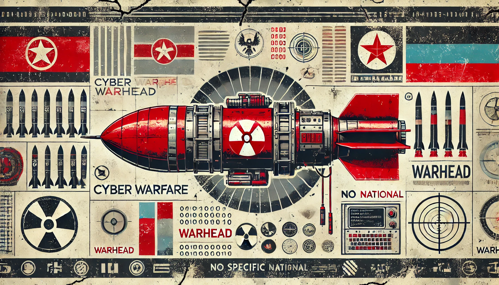

<p align="center">
  
</p>

<h1 align="center">Warhead</h1>

<p align="center">
  <strong>Atom Table Shellcode Injection & UAC Bypass Toolkit</strong><br>
  Covert code execution via Windows Atom Table manipulation.<br>
  Tested on Windows 10/11 (x64). For research and educational use only.
</p>

---

## 🔍 Overview

**Warhead** is a proof-of-concept offensive security toolkit that explores novel methods of Windows shellcode injection using the **Atom Table**, including:

- Shellcode storage and retrieval via `GlobalAddAtom` / `GetAtomName`
- Local and remote process injection (via direct memory write or APC)
- Hybrid UAC bypass payload launchers (e.g., via `fodhelper.exe`)
- Stealthy dropper/loader combinations with cross-session support

This project aims to showcase Atom-based payload delivery and execution as an evasion mechanism that abuses legitimate Windows APIs.

---

## 🧩 Features

| Feature                          | Description |
|----------------------------------|-------------|
| 🧬 **Shellcode Staging**        | Atom Table-based payload storage |
| 📤 **Remote Process Injection** | Target remote PIDs with shellcode using `WriteProcessMemory` or APC |
| ⚙️ **UAC Bypass**               | Execute payloads via `fodhelper.exe` elevation trick |
| 🧪 **Dropper Utilities**        | Standalone droppers that retrieve shellcode by Atom ID |
| 🧵 **APC Hybrid Mode**          | Execute Atom payloads via `QueueUserAPC` for stealth |
| 🔒 **Global Compatibility**     | Supports `GlobalAddAtom` for session-wide injection |
| 📝 **Logging / Debug Output**   | Clear logs for debugging payload execution paths |

---

## 🏗️ Architecture

```
                     +------------------+
                     |   Warhead.exe    |
                     | (Main Launcher)  |
                     +--------+---------+
                              |
                              v
          +------------------------------------+
          | 1. Add Payload to Atom Table       |
          |    - Local or Global Atom          |
          +------------------------------------+
                              |
                              v
          +------------------------------------+
          | 2. Identify Target Process (PID)   |
          |    - E.g. notepad.exe              |
          +------------------------------------+
                              |
                              v
          +------------------------------------+
          | 3. Inject Shellcode                |
          |    - WriteProcessMemory            |
          |    - or APC Injection              |
          +------------------------------------+
                              |
                              v
          +------------------------------------+
          | 4. Trigger Execution               |
          |    - Remote Thread or APC Dispatch |
          +------------------------------------+
```

---

## 🚀 Usage

### ✅ Prerequisites

- Windows 10/11 (x64)
- Admin privileges for certain injection types
- Visual Studio / mingw64 for compiling (if building from source)

### 🔧 Build

```bash
git clone https://github.com/youruser/warhead.git
cd warhead
cl /EHsc /FeWarhead.exe src/main.cpp
```

### 🛠️ Modes of Operation

#### 1. Add Shellcode to Atom Table

```bash
Warhead.exe --write-atom "cmd /c calc.exe"
```

Outputs Atom ID (e.g., `0xc000`) to be used in later stages.

#### 2. Inject to Remote Process

```bash
Warhead.exe --inject --pid 1234 --atom-id 0xc000
```

Uses `WriteProcessMemory` to inject Atom payload into process with PID 1234.

#### 3. APC Injection

```bash
Warhead.exe --apc --pid 1234 --atom-id 0xc000
```

Injects shellcode and schedules execution via `QueueUserAPC`.

#### 4. UAC Bypass Launcher

```bash
Warhead.exe --elevate --atom-id 0xc000
```

Uses `fodhelper.exe` to launch elevated process that reads Atom and executes it.

#### 5. Combined Dropper (One-Step Execution)

```bash
Warhead.exe --dropper --command "cmd /c calc.exe"
```

Writes to Atom Table, finds a remote target, injects and executes all in one go.

---

## 🧪 Example Output

```text
[DEBUG] Atom ID: 0xc000
[DEBUG] Local GetAtomNameA result: 21
[DEBUG] Atom content: cmd /c start calc.exe
[+] Found Notepad PID: 1234
[DEBUG] Remote Write success
[+] Atom shellcode launched from remote process.
```

---

## 📁 File Structure

```
├── img/
│   └── warhead.webp               # Project logo
├── src/
│   ├── main.cpp                   # Main launcher logic
│   ├── injector.cpp               # Process injection functions
│   ├── apc.cpp                    # APC scheduling logic
│   ├── uac_bypass.cpp             # fodhelper.exe launcher
│   └── utils.cpp                  # Helper and debug utilities
├── README.md
└── LICENSE
```

---

## ❗ Disclaimer

> This tool is provided **for educational and research purposes only**. Do not use it on systems you do not own or have explicit permission to test.

---

## 🧠 Credits

Developed by Malienist  
Inspired by public Atom Table and UAC bypass research

---

## 📌 To Do

- [ ] Add syscall-based injection fallback
- [ ] Implement Atom payload encryption
- [ ] Add multi-arch support (x86/x64)
- [ ] Integrate with Metasploit stager payloads
